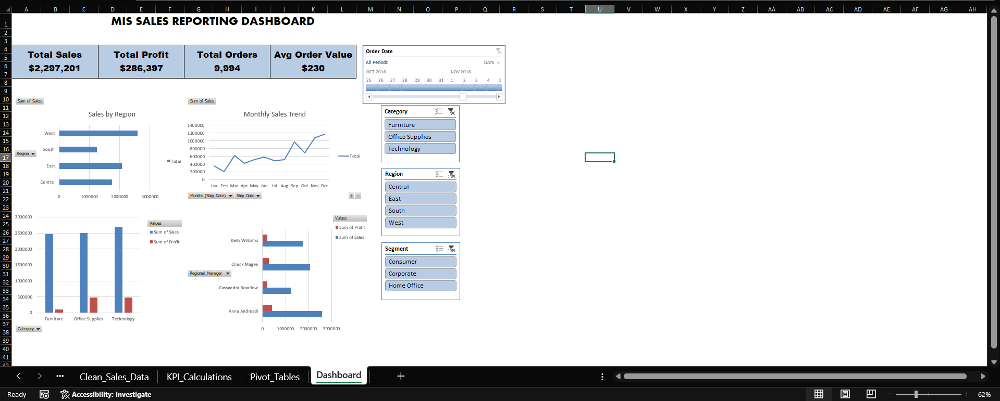
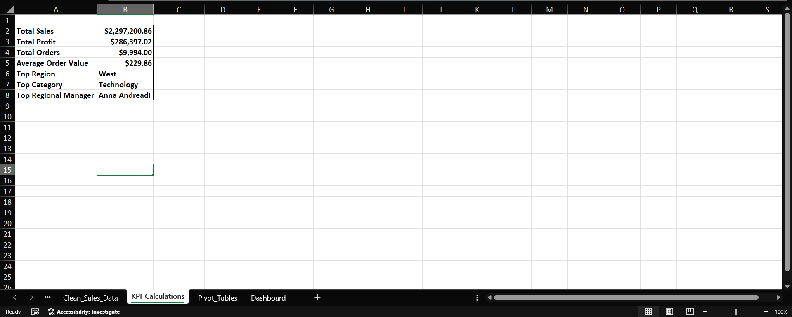
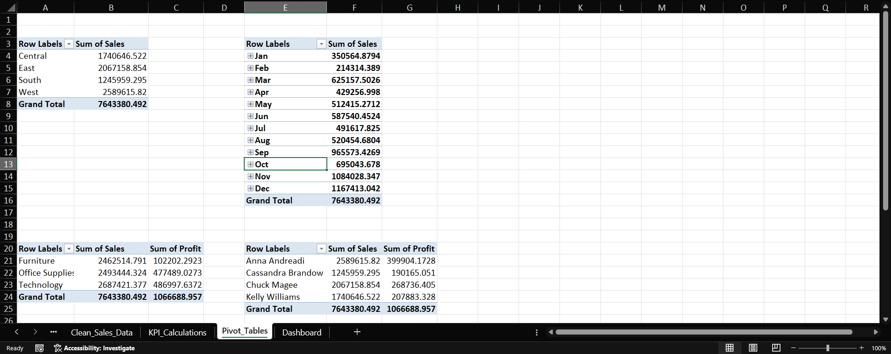

# MIS Sales Reporting Dashboard

## Project Overview

This project demonstrates the development of a Management Information System (MIS) Sales Reporting Dashboard using Microsoft Excel. The dashboard helps track business performance through key sales metrics, trend analysis, and interactive reporting features.

## Objectives

- Monitor sales performance
- Track key business KPIs
- Analyze sales trends
- Support data-driven decision making

## Tools Used

- Microsoft Excel
- Pivot Tables
- Pivot Charts
- Conditional Formatting
- Data Validation
- Excel Formulas

## Features

- Interactive Dashboard
- KPI Tracking
- Dynamic Filtering
- Monthly Sales Analysis
- Category-wise Performance Reporting

## Key Metrics

- Total Revenue
- Total Orders
- Average Order Value
- Top Performing Categories
- Regional Sales Analysis

## Dashboard Preview

### Main Dashboard

### KPI Section

### Pivot Tables

## Files Included

- MIS_SALES_REPORTING_PROJECT.xlsx
- Dashboard Screenshots

## Author

Sumedh Patil
